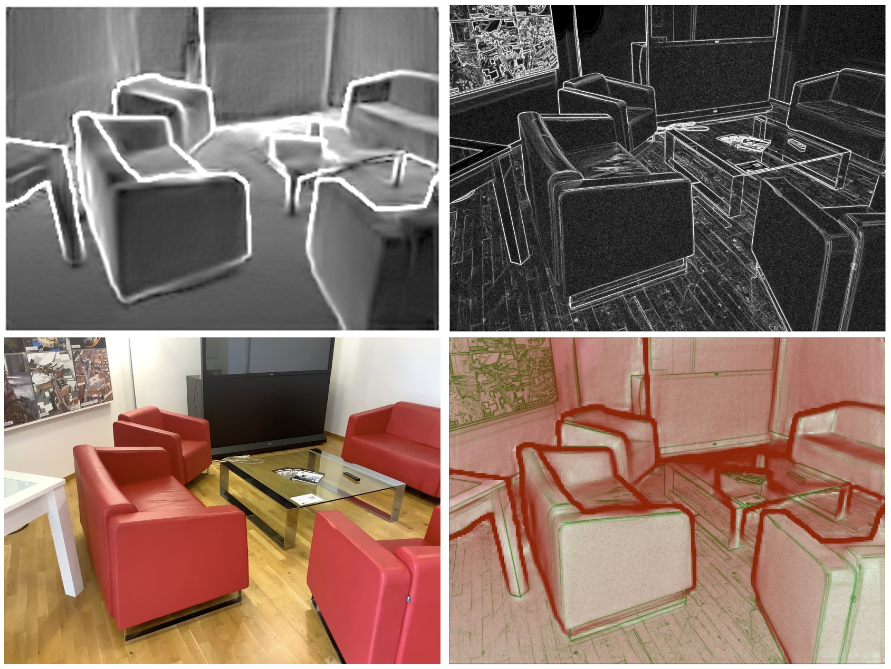

# ScanKit

ScanKit is a application developed for extracting Apple ARKits tracking and sensor data to facilitate external processing. It is intended as a technical foundation for specialized LiDAR-based scanning apps.

## Runtime Requirements

- Apple device with LiDAR sensor
- iOS 15 or later

## Point Cloud Generation
### Sobel Filters



[top-left: Sobel image of the depth map, top-right: Sobel image of the Y component of the RGB image, bottom-left: RGB image of the scene, bottom-right: colored top images combined]

This application uses Sobel filters for efficient pre-selection of recorded points. As already described in [Outlier detection in laser scanner point clouds](https://www.research-collection.ethz.ch/bitstream/handle/20.500.11850/37220/SOTO_653.pdf), point clouds often contain interpolation outliers at boundaries of occlusions. The same effect can be observed with point clouds recorded on Apple devices. The majority of these outliers can be discarded early using a Sobel filter on the depth map provided with each ARFrame. For each candidate point, its corresponding Sobel value is evaluated and if it crosses a certain threshold, the point is marked as unselected and discarded afterward.

To further reduce the data volume, applying Sobel filters on the RGB image can be used as a heuristic for approximating surfaces. If points lie on neither edge - of the RGB Sobel image or the depth Sobel image, it likely belongs to a surface. Since surfaces can be defined with only a few points, a high percentage of points that fall into this category are discarded.

## Development Notes

* [Cocoapods](https://cocoapods.org/)
    * run  ```pod install``` to fetch required libraries 
* [LAStools](https://github.com/LAStools/LAStools) compilation
    * `git clone https://github.com/cristeab/ios-cmake` (https://github.com/leetal/ios-cmake might work too)
    * `git clone https://github.com/LAStools/LAStools`
    * now make the following changes from within the LAStools folder
     1. add install prefix in CMakeLists.txt: `set(CMAKE_INSTALL_PREFIX "<path_to_xcode_project>/LAS")`
     2. `mkdir build`
     3. `cd build`
     4. `cmake .. -DCMAKE_TOOLCHAIN_FILE=<path_to_ios-cmake>/toolchain/iOS.cmake -DIOS_PLATFORM=OS` // cmake .. -DCMAKE_TOOLCHAIN_FILE=../../ios-cmake/toolchain/iOS.cmake -DIOS_PLATFORM=OS
     5. `make` (might fail because `system(...)` call is not allowed on iOS, if this is the case, follow additional steps...)
         * navigate to `LAStools/src/`
         * create a new file called `system_fix.cpp`
         * add the following code to this file 
         
         ```
         // source: https://github.com/libpd/pd-for-ios/issues/19#issuecomment-334133540
         #include <spawn.h>
         extern char **environ;
         int run_cmd(char *cmd)
         {
             pid_t pid;
             char *argv[] = {"sh", "-c", cmd, NULL};
             int status;

             status = posix_spawn(&pid, "/bin/sh", NULL, NULL, argv, environ);
             if (status == 0) {
                 if (waitpid(pid, &status, 0) == -1) {
                     perror("waitpid");
                 }
             }
             return status;
         }
         ```
         * open the file lasinfo.cpp
         * add the following dependency `#include "system_fix.cpp"`
         * replace all `system(...)` calls with `run_cmd(...)`
     6. `make install` (usage: see [StackOverflow](https://stackoverflow.com/questions/37804467/include-c-header-file-in-swift) )
     7. in the XCode settings of the project, under "General" -> "Frameworks, Libraries, and Embedded Content" add the `libLASlib.a` file from the newly created `<path_to_xcode_project>/LAS` folder

## Citing ScanKit

If you find ScanKit useful, please cite it in your publications:

```
@software{scankit2021github,
  author = {Kenneth Schroeder},
  title = {ScanKit: An iOS application for LiDAR data extraction},
  url = {https://github.com/Kenneth-Schroeder/ScanKit},
  organization = {Hasso Plattner Institute}
  year = {2021},
}
```

